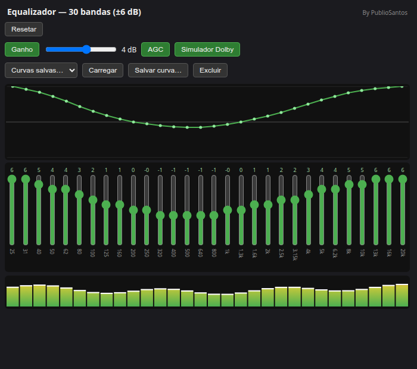

# Equalizador 30 Bandas — Extensão para Chrome

**Autor:** Publio Santos

Extensão para Chrome que adiciona um equalizador gráfico de 30 bandas em tempo real a qualquer áudio ou vídeo tocando no navegador, usando a Web Audio API.

> Leia em [inglês](README.md).



## Funcionalidades

- **30 bandas**, de 25 Hz a 20 kHz, ±6 dB por banda (padrão de equalizador gráfico).
- **Curva por arraste**: clique e arraste sobre o gráfico para desenhar uma curva — os potenciômetros deslizantes acompanham, com interpolação suave entre bandas.
- **Presets**: salvar, carregar e excluir curvas de equalização nomeadas.
- **Ganho (GainNode)**: estágio de ganho manual opcional (-24…+24 dB), aplicado depois do estágio Dolby para não sobrecarregar o saturador.
- **AGC (Controle Automático de Ganho)**: mede o volume (RMS) continuamente e ajusta o ganho em direção a um nível-alvo ao longo do tempo, em vez de aplicar um limitador abrupto.
- **Simulador estilo Dolby** *(não oficial, sem relação com processamento licenciado Dolby)*: brilho via shelf nos agudos + saturação harmônica suave + leve abertura estéreo (efeito Haas).
- **VU por banda**: medidor de 30 canais com pico fixo por 200 ms, lendo o sinal *depois* de todo o processamento (EQ, Dolby, Ganho, AGC) através de filtros bandpass estreitos dedicados — reflete o que realmente é enviado às caixas de som.

## Como funciona

Um content script conecta um grafo da Web Audio API a cada elemento `<audio>`/`<video>` da página:

```
fonte → 30 filtros EQ (peaking) → shelf de agudos Dolby → saturador Dolby
     → abertura estéreo (split/delay/merge) → ganho master → ganho AGC → saída
```

As configurações são salvas em `chrome.storage.local` e aplicadas em tempo real a todas as abas abertas.

## Instalação (sem compactação / uso local)

1. Abra `chrome://extensions`.
2. Ative o **Modo do desenvolvedor**.
3. Clique em **Carregar sem compactação** e selecione esta pasta.
4. Abra qualquer página com áudio/vídeo, clique no ícone da extensão e ajuste as bandas.

## Limitações

- Áudio dentro de `<iframe>` de origem cruzada não é controlado pelo content script do frame principal.
- O simulador Dolby é uma aproximação feita do zero com Web Audio, não é tecnologia licenciada pela Dolby.

## Licença

Licenciado sob a [Licença MIT](LICENSE).
